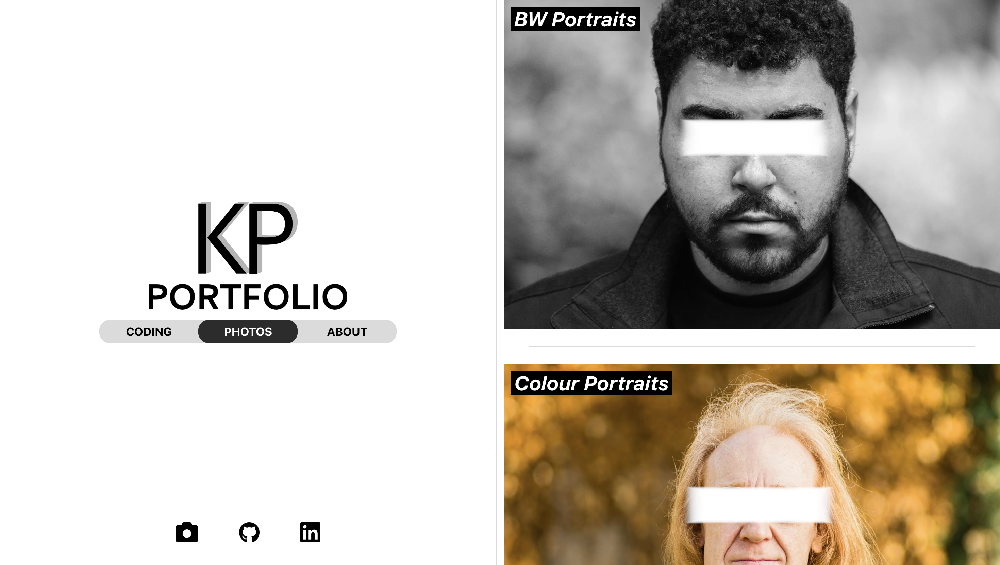

# Portfolio (alternative version, 2024)

### Launch the App

- Check out the live project [here!](https://krishhfi.github.io/Portfolio/#)

### About

- A project showcasing some of my favourite photography and coding projects
- Made in the summer of 2024
- In mid-2025 I censored all of my subjects faces to protect them from AI image generation
- My previous project named "React-Web-Application-2" was the starting point for this project. I retained the split screen format, but I made the app much more dyanamic and reusable. I refactored it significantlty and reduced a great deal of the original code.
